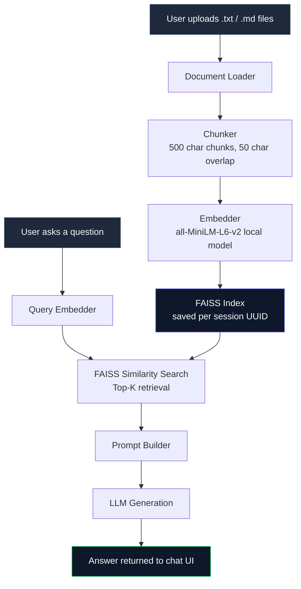

# Grounded


Upload your documents. Ask questions. Get answers grounded in your own content.

A full RAG pipeline built from scratch. No managed vector database, no third-party retrieval service. Local embeddings, FAISS, and a clean chat interface on top.

---

## ⚡ How it works



Each upload creates an isolated session with its own FAISS index. Sessions are UUID-based with path traversal protection built in.

---

## 🛠️ Stack

| Layer | Technology |
|---|---|
| Backend | Python, FastAPI |
| Vector Search | FAISS (flat L2 index) |
| Embeddings | sentence-transformers (all-MiniLM-L6-v2, runs locally) |
| Frontend | React, Vite, Tailwind CSS |
| Validation | Pydantic |
| Session Management | UUID-based, localStorage |

---

## 📁 Project structure

```
grounded/
├── backend/
│   ├── app/
│   │   ├── ingestion/        # loader, chunker, embedder, indexer
│   │   ├── retrieval/        # FAISS retriever
│   │   ├── generation/       # prompt builder, LLM call
│   │   ├── config.py         # all settings in one place
│   │   └── main.py           # FastAPI routes
│   └── data/
│       ├── raw/              # source documents
│       ├── processed/        # global vector store
│       └── uploads/          # per-session indexes
└── frontend/
    └── src/
        ├── components/       # ChatWindow, UploadPage, InputBox
        └── services/         # API calls
```

---

## 🚀 Running locally

**Backend**

```bash
cd backend
pip install -r requirements.txt
uvicorn app.main:app --reload
```

**Frontend**

```bash
cd frontend
npm install
npm run dev
```

Backend runs on `http://localhost:8000`. Frontend on `http://localhost:5173`.

---

## 🔌 API

<details>
<summary>POST /upload</summary>

```http
POST /upload
Content-Type: multipart/form-data

session_id: string (UUID)
files: .txt or .md files (max 10MB each, max 20 files per upload)
```
</details>

<details>
<summary>POST /chat</summary>

```http
POST /chat
Content-Type: application/json

{
  "question": "your question here",
  "session_id": "your-session-uuid"
}
```
</details>

<details>
<summary>GET /health</summary>

```http
GET /health
```
</details>

---

## ⚙️ Configuration

All settings live in `backend/app/config.py`:

| Setting | Default | What it controls |
|---|---|---|
| `CHUNK_SIZE` | 500 | Characters per chunk |
| `CHUNK_OVERLAP` | 50 | Overlap between chunks |
| `EMBEDDING_MODEL_NAME` | all-MiniLM-L6-v2 | Local embedding model |
| `TOP_K` | 5 | Chunks retrieved per query |
| `MAX_FILE_SIZE_BYTES` | 10MB | Per file upload limit |
| `MAX_FILES_PER_UPLOAD` | 20 | Files per session |

---

## 💡 What I learned building this

Chunking strategy matters more than most people expect. Fixed character chunking with overlap is simple and works well for most plain text. The real tradeoff is chunk size — too small and you lose context, too large and retrieval gets noisy.

Local embeddings with MiniLM keep latency low and cost at zero. For this scale it works well. At production scale with millions of chunks you would move to approximate nearest neighbour search and a proper vector database like Pinecone or Weaviate.

FAISS flat L2 search is exact and accurate. It is the right choice here. At scale you would switch to IVF or HNSW indexes depending on your latency and accuracy tradeoffs.

---

## 📬 Contact

Built by Abdullah Khalid

[](https://www.linkedin.com/in/-abdullah-khalid)
[](mailto:abdullahkh.cs@gmail.com)
[](https://ak-abdullah.github.io/Resume/)
